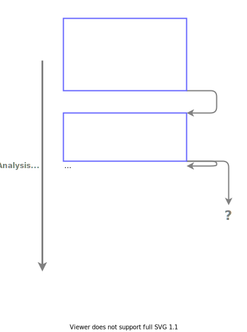
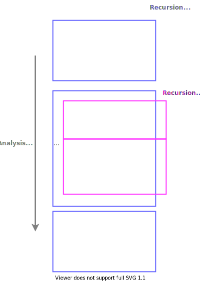
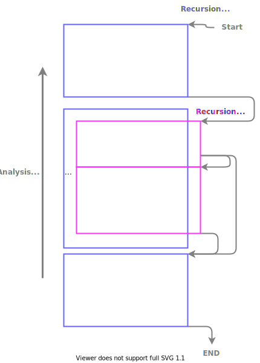

# Decent WASM Instruction Counter Implementation Details

## Code Analysis and Block-Flow Graph Generation

### WASM Code Representation

Instead of directly working on WASM or WAT, we use `wabt::Module` which is
an intermediate representation of WASM in
[WABT](https://github.com/WebAssembly/wabt/).
Thus, any format, including WASM and WAT, that can be deserialized by WABT, is
able to be instrumented by our library.
After the instrumentation is done, the instrumented `wabt::Module`instance
can be serialized to both WASM and WAT using WABT.


### Block-Flow Graph Generation

Similar to [AccTEE](https://github.com/ibr-ds/AccTEE/), we don't want to
increment the instruction counter after every instruction, since that could
cause extremely high overhead, instead, we only want to add an instruction
counter to the end of each block of code.

> NOTE: the "block of code" mentioned in here is different from the
> "`block` expression" given in WASM code


To generate a flow diagram of code blocks like the one shown above, we need to
analyze the code focusing on the flow control.
Additionally, we only generate block-flow graphs focusing on individual
functions, thus, the flow control expressions that jump to/from other functions
are not in our interests.



When iterating through the expression list from the beginning to the end, we can
easily identify the beginning and the end of each block of code.
However, it is challenging to figure out where the current block should connect
to, since the program has not found out what is the next block at this point.
And this is even more difficult for conditional branch expressions, because one
or more of the next blocks could be somewhere far away from the current block.

Therefore, our implementation consists of generally two iterations:
1. The analyzer iterates from top to bottom to identify all the blocks
2. The analyzer iterates from bottom to top to connect all the blocks found in
   the previous step



Each block begins with any regular expression, and ends with either an
in-function flow-control expression, or a `block`-like declaration expression.

A `block` declaration expression will become its own block, because it contains
all the expressions are nested inside.
Later, a recursive call is needed to perform the same analysis on expressions
nested inside the `block` expression.



In the previous iteration, all the discovered blocks are pushed onto a stack,
so that in this iteration, we can process from the last block of the program
to the first one, by popping the blocks from that stack.

Meanwhile, blocks that could be a target of the branch expression will be
pushed onto another stack, so that when the analyzer sees a branch statement,
it can easily identify the target block by searching through this stack.

### Optimization

[AccTEE](https://github.com/ibr-ds/AccTEE/) offers two types of optimizations
in order to reduce the overhead of instruction counter -
a) flow-based optimization and b) loop-based optimization.

In DecentWasmCounter, the block generator will preserve as much information as
possible, such as double-linked blocks, branch out type, etc.
All of this information provides the possibility for us to also support both
flow-based optimization and loop-based optimization in future works.

## Code Injection

After the block-flow graph is generated, and the cost for each block is
determined, we then need to inject the counter to each block to keep track
of the cost of instruction executions.

### Entry Function

In addition to counting instructions executed, we also provide over-limit
notification to the WASM runtime.
This is achieved by injecting a new entry function to replace the existing one.

For instance, we ask the developer to provide an entry function that has
the following prototype (expressed in C):

```c++
int _entry_function(uint8_t* rlpMsg, uint64_t msgLen)
{
    ...
}
```

This function expects a [RLP](https://eth.wiki/fundamentals/rlp) encoded message
as the function input, and returns an integer.

During instrumentation, we will inject another function to wrap around this one
as shown below:

```c++
int decent_entry_function(uint8_t* rlpMsg, uint64_t msgLen, uint64_t ctrThreshold)
{
    global_ctr_threshold = ctrThreshold;
    return _entry_function(rlpMsg, msgLen);
}
```

Our instrumentation code will scan through the `wabt::Module` structure to
ensure there is no other function is exported in the name of
`decent_entry_function`.

### Counter and Threshold Checking

To record the cost of instructions that have been executed, we inject three
elements into the code
1. A global `i64` value to store the cost of instructions
2. A function that expects an `i64` parameter as the increment of the counter,
   and compares the counter value with the threshold value (and calls the
   notification function when the threshold is exceeded)
3. Call the aforementioned increment function at the end of every block of code

The increment function introduced in the 2nd point above is defined as:
```wasm
(func (;3;) (param i64)
    local.get 0
    global.get 1
    i64.add
    global.set 1
    block  ;; label = @1
      global.get 1
      global.get 0
      i64.le_u
      br_if 0 (;@1;)
      global.get 1
      call 1
    end
)
```

This function first increments the global counter by the value given in the
parameter.
And then, it compares the global counter with the threshold.
If the counter value exceeds the threshold, the notification function will be
called, so that the WASM runtime can determine if it is necessary to terminate
the WASM program.

### Runtime Notification

The Decent WASM runtime offers a native function `decent_wasm_counter_exceed`,
which is supposed to be called when the global counter exceeds the threshold.

Due to the limitation that, in WASM, import expression must be presented before
any locally defined functions.
Thus, we cannot simply inject a new import statement into the WASM code.
To mitigate this issue, we ask developers to import the function in their
WASM code.
After that, our instrumentation code will check the import expression to
ensure the correct native notification function is imported.

```wasm
(import "env" "decent_wasm_counter_exceed" (func $ctr_exceed (param i64)))
```
